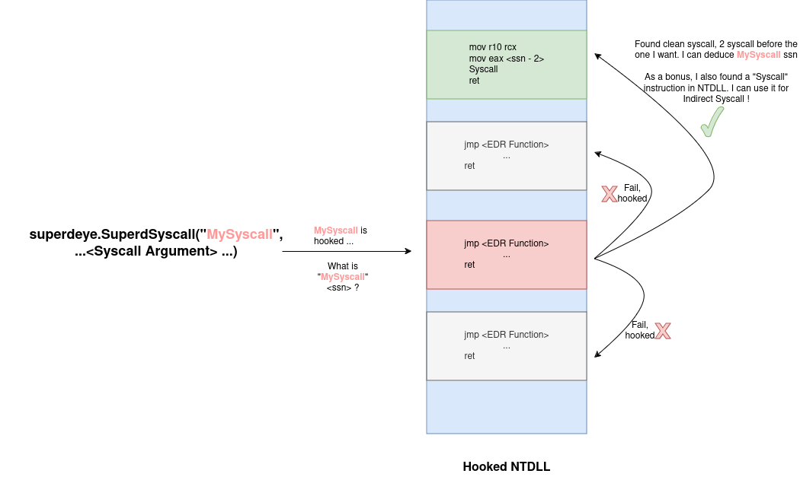

# SuperdEye


SuperdEye is the implementation of HellHall (a revised version of TartarusGate) in pure Go and Go Assembler.

The purpose is to scan hooked NTDLL and retrieve the Syscall number to then do an indirect Syscall with it, thus allowing the bypass of AV/EDR that put hooks on functions.

## Usage

Just import the package and use it !

The SuperdEye package exposes the `SuperSyscall` that can be used to do Indirect syscall.

```go
import (
	"fmt"
	"unsafe"

	"github.com/almounah/superdeye"
)
...

	NTSTATUS, err = superdeye.SuperdSyscall("NtCreateThreadEx", uintptr(unsafe.Pointer(&hThread)), uintptr(0x1FFFFF), uintptr(0), handleProcess, pBaseAddress, uintptr(0), uintptr(0), uintptr(0), uintptr(0), uintptr(0), uintptr(0))
	if err != nil {
        fmt.Println("Syscall Was not executed due. Likely the Syscall was not found or a bug...")
		fmt.Println(err.Error())
	}
	fmt.Println("Syscall NtCreateThreadEx Made with NTSTATUS ", NTSTATUS)

```

For better usability, some syscall are already wrapped to be compatible with the official `golang.org/x/sys/windows` package. 

```go
import (
	"fmt"
	"unsafe"

	"github.com/almounah/superdeye"
	"golang.org/x/sys/windows"
)
...
	pBaseAddress, NTSTATUS, err := superdeye.NtAllocateVirtualMemory(windows.Handle(handleProcess), uintptr(0), uintptr(len(payloadClearText)), windows.MEM_COMMIT|windows.MEM_RESERVE, windows.PAGE_EXECUTE_READWRITE)
	if err != nil {
        fmt.Println("Syscall Was not executed due. Likely the Syscall was not found or a bug...")
		fmt.Println(err.Error())
	}
	fmt.Println("Syscall NtAllocateVirtualMemory Made with NTSTATUS ", NTSTATUS)
...
```

More Syscalls will be made compatible with the official windows package in the future (Contributions are welcome in `superdwrapper.go`)

## Examples

Full examples are given in `examples/`

## What does it do ?

It is the implementation of TartarusGate by trickster0 and HellHall by mrd0x and NUL0x4C in Go.

Basically, a hooked NTDLL will be scanned. Once the target function is found, in case it is hooked by an AV or an EDR, a scan of the neighboors above and below will be made until a clean syscall is found. This will allow the calculation of the target function ssn. 

Once the ssn is found, an indirect syscall will be constructed.

I tried illustrating the principle with the following diagram.




## Other Similar Tools in Go

Other notable tools that are worth noting are [BananaPhone](https://github.com/C-Sto/BananaPhone/tree/master) and [acheron](https://github.com/f1zm0/acheron).

BananaPhone uses a similar aproach to HellHall and TartarusGate but does not search far in the neighbor. Plus the syscall is direct. BananaPhone is the equivalent of the HellGate project in Go.

Acheron on the other hand, use a totally different aproach than HellGate and HellHall (and TartarusGate). Basically, at the beginning Acheron scan all the NTDLL, sort all the function's hashes by address. The ssn is then deduced by simply calculating the index of the function in the address list. In Acheron the syscall is an indirect one. Acheron is the equivalent of the SysWhisper3 project in Go.

## Side Story: Why the name SuperdEye

In [Mushoku Tensei](https://myanimelist.net/anime/39535/Mushoku_Tensei__Isekai_Ittara_Honki_Dasu) the Superd is a tribal Demonic Race from the Demon Continent. They have green emerald Hair and a third Eye on their forehead that let them perceive mana not detectable by others.

The superd tribe are hated by Demons and Human alike due to historical reason. A Superd is hated and feared for just being a Superd.

I named this project SuperdEye as it let you percieve syscall number and do indirect syscall, much like having a Superd Eye will let you detect mana and fight the enemy.
