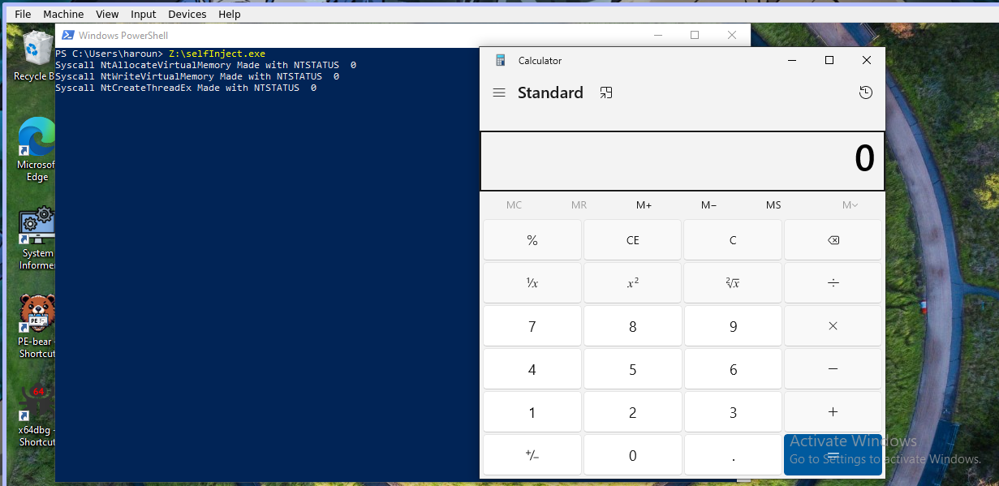

# Simple Shellcode Injector

This will chain Syscalls to:

- Allocate Memory in the current process
- Write Shellcode in it (without encryption)
- Run a new thread with the shellcode address

It uses SuperdEye with syscalls only.

The code is commented a little. It shows the two use cases, where the syscall is predefined in SuperdEye and the case the Syscall is not predefined by SuperdEye.

To build cd into this directory and do:

```
go build -ldflags="-s -w" -trimpath
```


